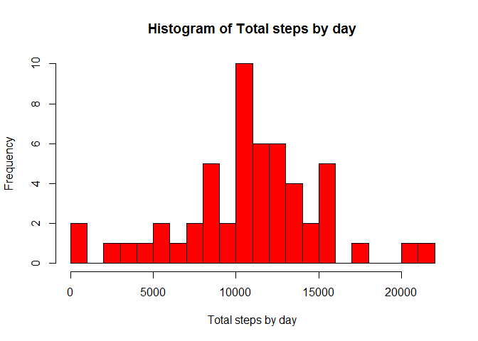
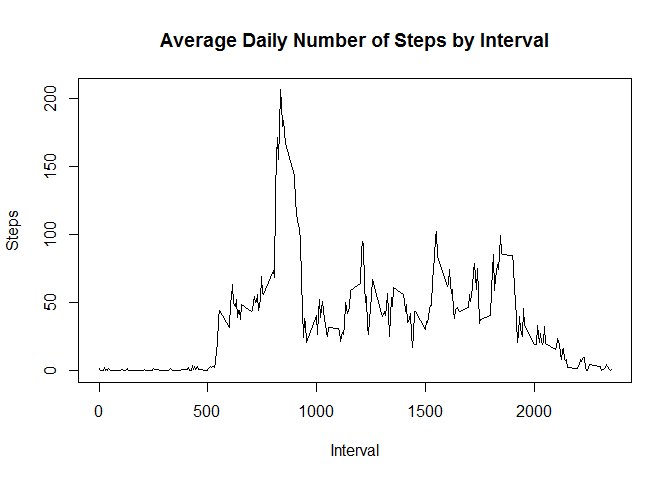
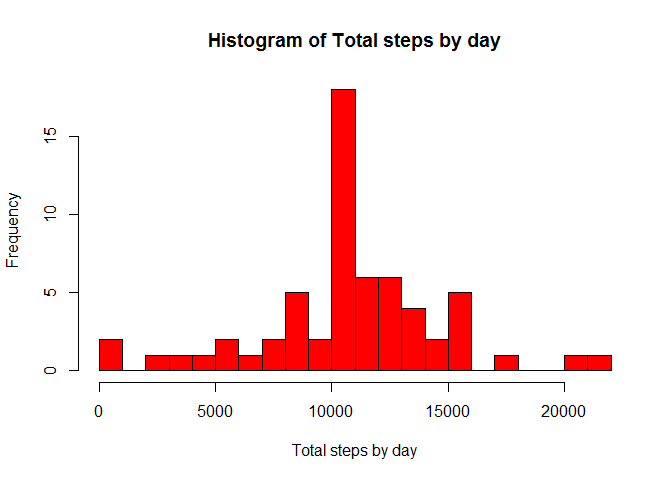
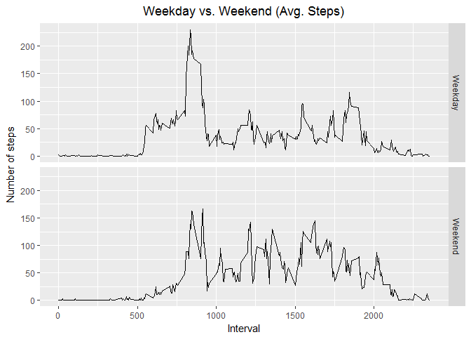

# Reproducible Research: Peer Assessment 1

##Introduction
It is now possible to collect a large amount of data about personal movement using activity monitoring devices such as a Fitbit, Nike Fuelband, or Jawbone Up. These type of devices are part of the "quantified self" movement - a group of enthusiasts who take measurements about themselves regularly to improve their health, to find patterns in their behavior, or because they are tech geeks. But these data remain under-utilized both because the raw data are hard to obtain and there is a lack of statistical methods and software for processing and interpreting the data.

This assignment makes use of data from a personal activity monitoring device. This device collects data at 5 minute intervals through out the day. The data consists of two months of data from an anonymous individual collected during the months of October and November, 2012 and include the number of steps taken in 5 minute intervals each day.

##Data

Create the directoty "RepData_PeerAssessment1" in your local working folder.  
Fork/clone the [GitHub repository created for this assignment](https://github.com/rdpeng/RepData_PeerAssessment1)

Unzip the file "activity.zip" in folder "RepData_PeerAssessment1".

The variables included in this dataset are:  
  -**steps:** Number of steps taking in a 5-minute interval (missing values are coded as NA)  
  -**date:** The date on which the measurement was taken in YYYY-MM-DD format  
  -**interval:** Identifier for the 5-minute interval in which measurement was taken  
  
The dataset is stored in a comma-separated-value (CSV) file and contains a total of 17,568 observations.
  
## Loading and preprocessing the data

Assume that "activity.csv" file is inside the "activity" folder. Process the .csv file using the read.csv function and format the date.


```r
#read the activity data
activitydata <- read.csv("./activity/activity.csv")
#convert the date data from factor to date format
activitydata$date <- as.Date(activitydata$date, "%Y-%m-%d")
```

## What is mean total number of steps taken per day?

Compute the steps taken per day (ignore the NA values).

1. Plot Histogram of the total number of steps taken each day


```r
#compute the sum of steps taken per day (based on date)
dailysteps <- aggregate(steps ~ date, data = activitydata, FUN = sum, na.rm = TRUE)
#plot the histogram with 20 cells
hist(dailysteps$steps, main= "Histogram of Total steps by day", xlab = "Total steps by day", col = "red", breaks = 20)
```

<!-- -->

2. Compute Mean and median number of steps taken each day


```r
#mean and median of daily steps
meansteps <- mean(dailysteps$steps, na.rm = TRUE)
mediansteps <- median(dailysteps$steps, na.rm = TRUE)

#Print Mean
print(meansteps)
```

```
## [1] 10766.19
```


```r
#Print median
print(mediansteps)
```

```
## [1] 10765
```

## What is the average daily activity pattern?

1.Time series plot of the average number of steps taken

Timeseries plot of steps vs interval 


```r
#get the average number of steps per interval
avgsteps <- aggregate(steps ~ interval, data = activitydata, FUN = mean, na.rm=TRUE)
#plot time series, steps vs interval
plot(avgsteps$interval, avgsteps$steps, type="l", xlab="Interval", ylab="Steps",main="Average Daily Number of Steps by Interval")
```

<!-- -->

2.Which 5-minute interval, on average across all the days in the dataset, contains the maximum number of steps?

Get the interval with maximum number of steps.


```r
#Get the interval with maximum number of steps.
avgsteps[which.max(avgsteps$steps), 1]
```

```
## [1] 835
```

## Imputing missing values

1. Code to describe and show a strategy for imputing missing data

Check for the missing values in the current dataset and get the number of days this sampling is done.


```r
#Check for the missing values in the current dataset
missing <- is.na(activitydata$steps)

#get the number of days this sampling is done
totaldays <- length(levels(as.factor(activitydata$date)))
```

Fill the missing values with the avarage/mean value for that interval and assign to the new activity data variable


```r
#create the new variable matching the existing activity data
imputedactivitydata <- activitydata

#fill the missing values with the mean for that interval. Data for whole day is missing so we can use the rep to fill in the missing data
imputedactivitydata[missing,]$steps <- rep(avgsteps[,2], totaldays)[missing]
```

2. Histogram of the total number of steps taken each day after missing values are imputed


```r
#compute the sum of steps taken per day (based on date)
dailystepsimputed <- aggregate(steps ~ date, data = imputedactivitydata, FUN = sum)

#plot the histogram with 20 cells
hist(dailystepsimputed$steps, main= "Histogram of Total steps by day", xlab = "Total steps by day", col = "red", breaks = 20)
```

<!-- -->

Calculate the mean and median before and after imputing the missing values


```r
#mean and median of daily steps are filling missing values
imputeddate_meansteps <- mean(dailystepsimputed$steps, na.rm = TRUE)
mputeddate_mediansteps <- median(dailystepsimputed$steps, na.rm = TRUE)

c("Mean Before" = meansteps, "Mean After" = imputeddate_meansteps)
```

```
## Mean Before  Mean After 
##    10766.19    10766.19
```

```r
c("Median Before" = mediansteps, "Median After" = mputeddate_mediansteps)
```

```
## Median Before  Median After 
##      10765.00      10766.19
```

## Are there differences in activity patterns between weekdays and weekends?

Use weekdays() function to know the day of the week. Create new variable and assign the weekday

Use ifelse to categorize "weekday" and "weekend"


```r
#Assign day of the week using weekdays function
imputedactivitydata$day <- weekdays(imputedactivitydata$date)
#Use ifelse to categorize "weekday" and "weekend"
imputedactivitydata$daytype <- ifelse(imputedactivitydata$day == "Saturday" | imputedactivitydata$day == "Sunday", "Weekend", "Weekday")
#change the varibale to factor
imputedactivitydata$daytype <- as.factor(imputedactivitydata$daytype)
```

1. Panel plot comparing the average number of steps taken per 5-minute interval across weekdays and weekends

Use ggplot to plot the differences of steps during weekdays and weekends


```r
library(ggplot2)
```

```
## Warning: package 'ggplot2' was built under R version 3.4.1
```

```r
#calculate the average steps based on daytype
avgstepsimputed <- aggregate(steps ~ interval + daytype, data = imputedactivitydata, FUN = mean)

#plot the differences in activity patterns between weekdays and weekends
ggplot(data = avgstepsimputed, aes(avgstepsimputed$interval, avgstepsimputed$steps, type =daytype)) + facet_grid(daytype ~ .) + geom_line() + ggtitle("Weekday vs. Weekend (Avg. Steps)") + xlab("Interval") + ylab("Number of steps") + theme(plot.title = element_text(hjust = 0.5))
```

<!-- -->

